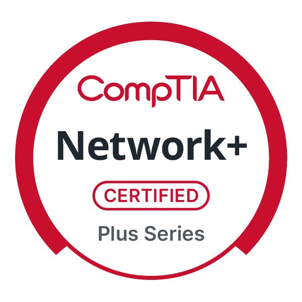

## **Education**  

  

- **Master's Degree in Cybersecurity**  
   - **The University Of Tulsa** 

  

- **Bachelor's Degree in Cybersecurity**  
   - **Sam Houston State University** 

## **Continuing Education and Training Platforms**

  

- **Languages and Tools**  

   
  

---

## **📚About Me**  

-  I’m currently working on expanding my foundational skills.    
   - Focusing on obtaining my **AZ900** from **Microsoft**.    
   - Enrolled in and working towards my **Offensive Security Certified Professional (OSCP)**.      

---

